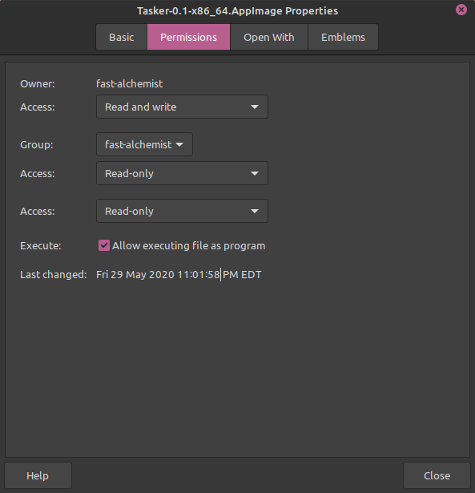

  

# Tasker

# Table of Contents
1. [Pitch](#pitch)
2. [Usage](#usage)
2. [How do I get Tasker?](#how_do_I_get_tasker)

## Pitch 

Many people(including us) have creative pursuits; projects we want to allocate time for; goals to accomplish. In our team, I write; Gem(a contributor to the project) plays music. It’s always been hard for us, and we suspect for many other people, to stay on task. More specifically, it’s even harder to keep track of one’s progress. The timers of our world—smartphones, desktops, etc—aren’t designed to accurately time the tasks we do.

One of the reasons for this is that human error is inevitable. A writer like myself may set the timer to 30 minutes, but halfway through the writing session, I might go make tea. If one is doing it right, making tea takes time. I forget to stop my timer, which is supposed to keep me attached to the keyboard for 30 minutes. In the meantime, while time runs out, I’m setting up the pot, waiting for it to boil, take my tea bag to dip in, fetch milk, make toast. When I come back to my novel, the timer ran out!

Even though my timer counted 30 minutes, I only did 15 minutes of writing. This is not ideal. Tasker aims to solve this problem, or at the very least make our timers more accurate (hence mitigating human errors) by binding our timers to hardware.

This means that while a session is opened in Tasker, it will be detecting hardware interaction. We **DO NOT** record keyboard strokes or sound. We buffer it temporarily and throw it away once we run it through some logic.

# Usage 
## Commitments
Tasker has the concept of "commitments". A commitment in Tasker is exactly what it sounds like; it is an activity that one commits to for a certain period of time, or
indefinitely. This could be something like committing to write a novel within a year. Or play an instrument everyday, which is what I use it for.

*TODO:* Add example images to illustrate this better.

# How do I get Tasker? 
You can get it [here](https://github.com/thebigG/Tasker/releases)

## On Linux 

1.Right-click the AppImage  
2.Click on "properties"  
3.Make sure to  check the "Allow Executing file as a program" box  

To make your life more convinient with appimages I highly recommend downloading this https://github.com/TheAssassin/AppImageLauncher

## On macOS

  
  
  
**NOTE:** For the mouse and keyboard hooks to work, you **must** give accessibility permissions to Tasker. For the Microphone hooks, you **must** give Microphone permission to Tasker.

If you were prompted to give permission, like in the image above, then tick the box in Accessbility menu for Tasker and restart Tasker. You only have to do this once. After the first time you do it, you will always be able to use the mouse and keyboard hooks. 

You also have to give Microphone permissions to Tasker just like the mouse/keyboard hooks. Except for the Microphone, you don't have to restart Tasker after you allow Microphone Access.

### Updating Tasker on macOS
When updating Tasker in macOS; meaning re-downloading a new .app file from the release page, to avoid any headaches, **re-enable** all of the accessibility and microphone permisions on macOS preferences. That means removing Tasker from the list of allowed apps on the Accessibility and Microphone sections and **re-adding** that new Tasker.app file you just downloaded. If you don't do this, Tasker wil **not** work properly because macOS still thinks that those permissions belong to the older Tasker version you had.

**NOTE**:Will be packaging for Windows10 very  soon :)

# Building The Dependencies
Tasker uses libuiohook to process mouse and keyboard input. In order to run the XHook, which is what detects
the mouse and keyboard input, you **must** build the `libuiohook` project. Just `cd` into `libuiohook` and follow the instructions on the readme :). After that, cd into `Tasker/libs/XHook` and build that. I suggest you build `XHook` from Qt Creator to make your life easy. This build system is half-baked right now, but I will make this process a lot smoother in the future.

# How do I help?

The default branch is **main**
PRs and issues always welcome!
Another way to help is to test Tasker with different keyboard/mouse/hardware and post an issue if a specific one does not work!

Would like to give credit to the devs at https://github.com/kwhat/libuiohook
libuiiohook is the library that makes it possible for Tasker to detect mouse and keyboard interaction!

Tasker is built using Qt 5 using c++. So you need to be comfortable using those technologies. If you aren't that's cool, we're still learning!

To get started I highly recommend these resources:

[Programming: Principles and Practice Using C++](https://www.amazon.com/Programming-Principles-Practice-Using-2nd/dp/0321992784/ref=sr_1_1?keywords=Programming%3A+Principles+and+Practice+Using+C%2B%2B&qid=1577916888&sr=8-1)

[https://doc.qt.io/](https://doc.qt.io/)

[https://www.youtube.com/user/TheChernoProject](https://www.youtube.com/user/TheChernoProject)

[https://www.qt.io/download-qt-installer](https://www.qt.io/download-qt-installer)
